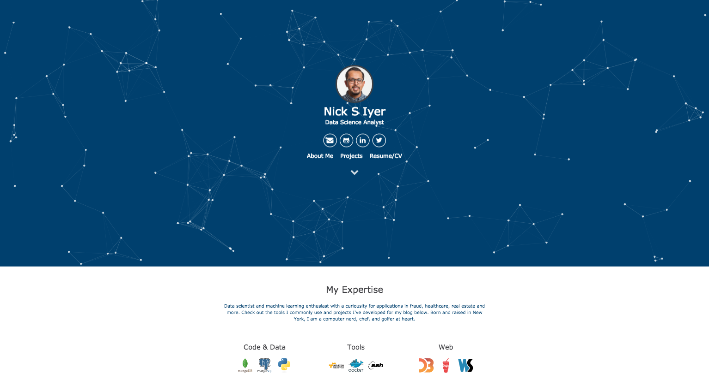

# My Website

This is a simple and minimalist website generated with Jekyll and designed to show off my portfolio.

The Theme features:

- Gulp
- SASS
- Sweet Scroll
- Particle.js
- BrowserSync
- Font Awesome and Devicon icons
- Google Analytics

## License

This website used free and open source software, distributed under the The MIT License.

## Credits

This theme was designed with the inspiration and adaptation from work by these fine folks:
- [Willian Justen](https://github.com/willianjusten/will-jekyll-template)
- [Vincent Garreau](https://github.com/VincentGarreau/particles.js/)
- [Nathan Randecker](https://github.com/nrandecker/particle)
