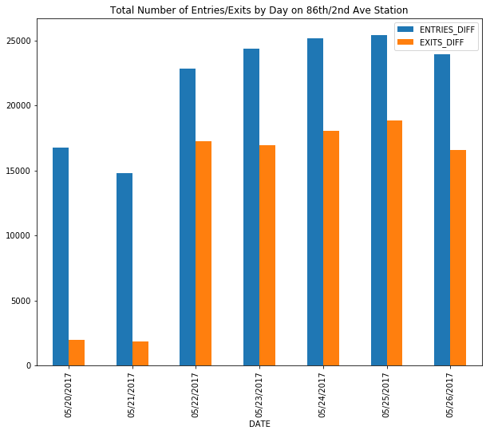
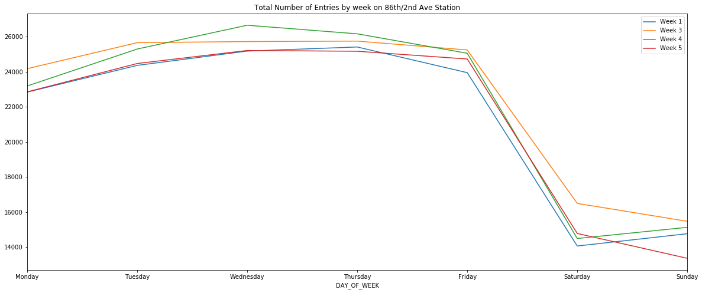
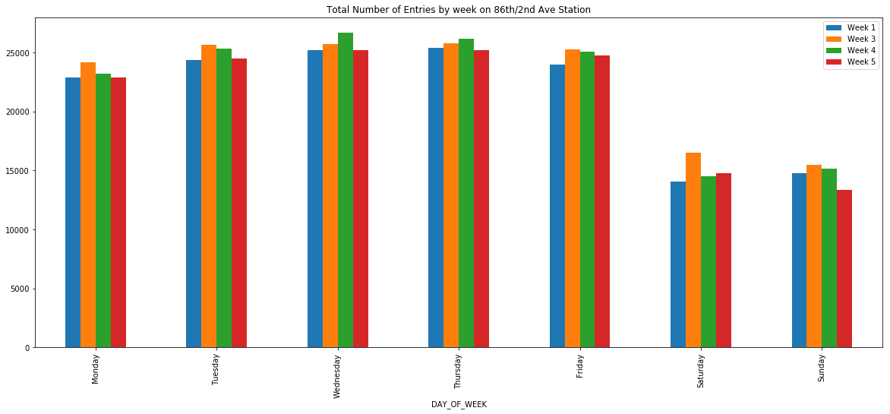
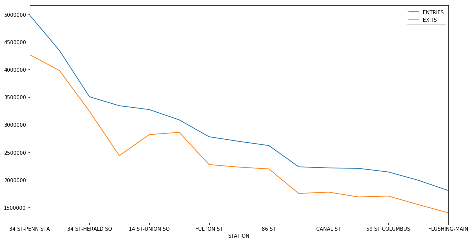
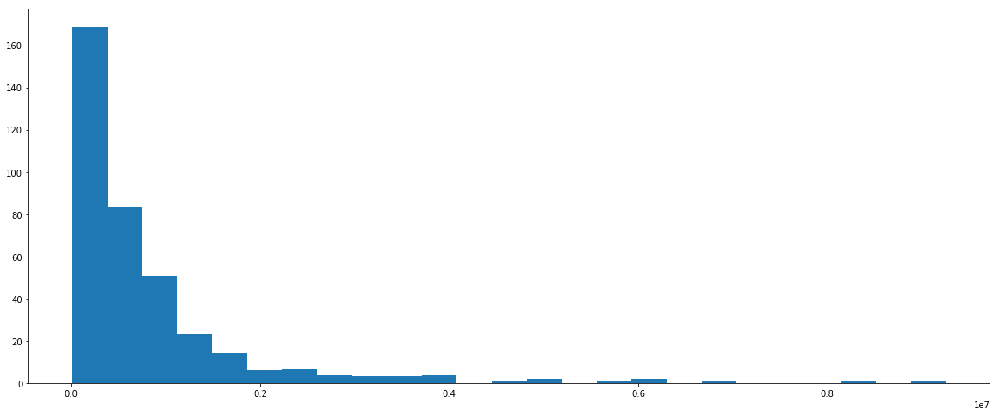

## Welcome to Challenge 1 - MTA Turnstile Data Notebook!

In this series, I will be exploring MTA turnstile data as part of what we've learned in our first week at Metis

#### This is Challenge 1 using pandas

Open up a new IPython notebook
Download a few MTA turnstile data files
Open up a file, use csv reader to read it, make a python dataframe.


```python
# Import all important functions from python libraries

from __future__ import print_function, division
import pandas as pd
from IPython.display import Image
import dateutil.parser
```


```python
# Function to scrape the mta data directly from the website

def get_data(week_nums):
    url = "http://web.mta.info/developers/data/nyct/turnstile/turnstile_{}.txt"
    dfs = []
    for week_num in week_nums:
        file_url = url.format(week_num)
        dfs.append(pd.read_csv(file_url))
    return pd.concat(dfs)
```


```python
# Load the dataset. This is just one week but can use this to then return multiple weeks

week_nums = [170527]
df = get_data(week_nums)
```


```python
# Set the columns we want to see

cols = ['C/A', 'UNIT', 'SCP', 'STATION', 'LINENAME', 'DIVISION', 'DATE', 'TIME', 'DESC', 'ENTRIES', 'EXITS']
df.columns = cols
```

#### Challenge 2 pandas

Let's turn this into a time series.
For each key (basically the control area, unit, device address and station of a specific turnstile), have a list again, but let the list be comprised of just the point in time and the count of entries.

This basically means keeping only the date, time, and entries fields in each list. You can convert the date and time into datetime objects -- That is a python class that represents a point in time


```python
# Set new dataframe to be used for this challenge. Return the entries/exits times.
# These values are ticker counts, so we eventually need to retrieve the difference
# in order to get actual counts per time block

main_df = df
import datetime as dt
main_df['NEW_TIME'] = pd.to_datetime(main_df['DATE'] + main_df['TIME'], format = '%m/%d/%Y%H:%M:%S')
ch2 = main_df.groupby(['C/A', 'UNIT', 'SCP', 'STATION', 'NEW_TIME']).sum()
```


```python
# Sample of data
print(ch2.head(10))
```

                                                    ENTRIES    EXITS
    C/A  UNIT SCP      STATION NEW_TIME                             
    A002 R051 02-00-00 59 ST   2017-05-20 00:00:00  6184841  2095161
                               2017-05-20 04:00:00  6184865  2095167
                               2017-05-20 08:00:00  6184891  2095192
                               2017-05-20 12:00:00  6184973  2095275
                               2017-05-20 16:00:00  6185217  2095326
                               2017-05-20 20:00:00  6185506  2095379
                               2017-05-21 00:00:00  6185634  2095402
                               2017-05-21 04:00:00  6185655  2095410
                               2017-05-21 08:00:00  6185665  2095420
                               2017-05-21 12:00:00  6185734  2095480


```python
# Shift the time frames, subtract them, get the difference between the entry/exits

main_df['PREV_TIME'] = df['TIME'].shift(1)
main_df['PREV_ENTRIES'] = df['ENTRIES'].shift(1)
main_df['PREV_EXITS'] = df['EXITS'].shift(1)
new_cols = ['C/A', 'UNIT', 'SCP', 'STATION', 'LINENAME', 'DIVISION', 'DATE', 'PREV_TIME', 'TIME',
            'DESC', 'ENTRIES', 'PREV_ENTRIES', 'EXITS', 'PREV_EXITS']
main_df = main_df[new_cols]
col_groups = main_df.groupby(['C/A','UNIT','SCP','STATION'])
subEntries = (main_df['ENTRIES'] - main_df['PREV_ENTRIES'])
subExits = (main_df['EXITS'] - main_df['PREV_EXITS'])
main_df['ENTRIES_DIFF'] = subEntries
main_df['EXITS_DIFF'] = subExits
```


```python
# There were times that the tickers would reset. 
# So we eliminate any erroneous counts that can skew the data

main_df = main_df[(main_df['ENTRIES_DIFF'] >= 0) & (main_df['ENTRIES_DIFF'] <=50000)]
main_df = main_df[(main_df['EXITS_DIFF'] >= 0) & (main_df['EXITS_DIFF'] <=50000)]
```


```python
#Sample print of the top values of full frame

main_df.head()
```


<div>
<style>
    .dataframe thead tr:only-child th {
        text-align: right;
    }

    .dataframe thead th {
        text-align: left;
    }

    .dataframe tbody tr th {
        vertical-align: top;
    }
</style>
<table border="1" class="dataframe">
  <thead>
    <tr style="text-align: right;">
      <th></th>
      <th>C/A</th>
      <th>UNIT</th>
      <th>SCP</th>
      <th>STATION</th>
      <th>LINENAME</th>
      <th>DIVISION</th>
      <th>DATE</th>
      <th>PREV_TIME</th>
      <th>TIME</th>
      <th>DESC</th>
      <th>ENTRIES</th>
      <th>PREV_ENTRIES</th>
      <th>EXITS</th>
      <th>PREV_EXITS</th>
      <th>ENTRIES_DIFF</th>
      <th>EXITS_DIFF</th>
    </tr>
  </thead>
  <tbody>
    <tr>
      <th>1</th>
      <td>A002</td>
      <td>R051</td>
      <td>02-00-00</td>
      <td>59 ST</td>
      <td>NQR456W</td>
      <td>BMT</td>
      <td>05/20/2017</td>
      <td>00:00:00</td>
      <td>04:00:00</td>
      <td>REGULAR</td>
      <td>6184865</td>
      <td>6184841.0</td>
      <td>2095167</td>
      <td>2095161.0</td>
      <td>24.0</td>
      <td>6.0</td>
    </tr>
    <tr>
      <th>2</th>
      <td>A002</td>
      <td>R051</td>
      <td>02-00-00</td>
      <td>59 ST</td>
      <td>NQR456W</td>
      <td>BMT</td>
      <td>05/20/2017</td>
      <td>04:00:00</td>
      <td>08:00:00</td>
      <td>REGULAR</td>
      <td>6184891</td>
      <td>6184865.0</td>
      <td>2095192</td>
      <td>2095167.0</td>
      <td>26.0</td>
      <td>25.0</td>
    </tr>
    <tr>
      <th>3</th>
      <td>A002</td>
      <td>R051</td>
      <td>02-00-00</td>
      <td>59 ST</td>
      <td>NQR456W</td>
      <td>BMT</td>
      <td>05/20/2017</td>
      <td>08:00:00</td>
      <td>12:00:00</td>
      <td>REGULAR</td>
      <td>6184973</td>
      <td>6184891.0</td>
      <td>2095275</td>
      <td>2095192.0</td>
      <td>82.0</td>
      <td>83.0</td>
    </tr>
    <tr>
      <th>4</th>
      <td>A002</td>
      <td>R051</td>
      <td>02-00-00</td>
      <td>59 ST</td>
      <td>NQR456W</td>
      <td>BMT</td>
      <td>05/20/2017</td>
      <td>12:00:00</td>
      <td>16:00:00</td>
      <td>REGULAR</td>
      <td>6185217</td>
      <td>6184973.0</td>
      <td>2095326</td>
      <td>2095275.0</td>
      <td>244.0</td>
      <td>51.0</td>
    </tr>
    <tr>
      <th>5</th>
      <td>A002</td>
      <td>R051</td>
      <td>02-00-00</td>
      <td>59 ST</td>
      <td>NQR456W</td>
      <td>BMT</td>
      <td>05/20/2017</td>
      <td>16:00:00</td>
      <td>20:00:00</td>
      <td>REGULAR</td>
      <td>6185506</td>
      <td>6185217.0</td>
      <td>2095379</td>
      <td>2095326.0</td>
      <td>289.0</td>
      <td>53.0</td>
    </tr>
  </tbody>
</table>
</div>


#### Challenge 3

These counts are for every n hours. (What is n?) We want total daily entries.
Now make it that we again have the same keys, but now we have a single value for a single day, which is the total number of passengers that entered through this turnstile on this day.


```python
# Isolate only those columns we care about

main_df = main_df[['C/A', 'UNIT', 'SCP', 'STATION', 'LINENAME', 'DIVISION', 'DATE',
                   'TIME', 'ENTRIES_DIFF', 'EXITS_DIFF']]
```


```python
# Sample the data to make sure we have only what we need

main_df.head()
```


<div>
<style>
    .dataframe thead tr:only-child th {
        text-align: right;
    }

    .dataframe thead th {
        text-align: left;
    }

    .dataframe tbody tr th {
        vertical-align: top;
    }
</style>
<table border="1" class="dataframe">
  <thead>
    <tr style="text-align: right;">
      <th></th>
      <th>C/A</th>
      <th>UNIT</th>
      <th>SCP</th>
      <th>STATION</th>
      <th>LINENAME</th>
      <th>DIVISION</th>
      <th>DATE</th>
      <th>TIME</th>
      <th>ENTRIES_DIFF</th>
      <th>EXITS_DIFF</th>
    </tr>
  </thead>
  <tbody>
    <tr>
      <th>1</th>
      <td>A002</td>
      <td>R051</td>
      <td>02-00-00</td>
      <td>59 ST</td>
      <td>NQR456W</td>
      <td>BMT</td>
      <td>05/20/2017</td>
      <td>04:00:00</td>
      <td>24.0</td>
      <td>6.0</td>
    </tr>
    <tr>
      <th>2</th>
      <td>A002</td>
      <td>R051</td>
      <td>02-00-00</td>
      <td>59 ST</td>
      <td>NQR456W</td>
      <td>BMT</td>
      <td>05/20/2017</td>
      <td>08:00:00</td>
      <td>26.0</td>
      <td>25.0</td>
    </tr>
    <tr>
      <th>3</th>
      <td>A002</td>
      <td>R051</td>
      <td>02-00-00</td>
      <td>59 ST</td>
      <td>NQR456W</td>
      <td>BMT</td>
      <td>05/20/2017</td>
      <td>12:00:00</td>
      <td>82.0</td>
      <td>83.0</td>
    </tr>
    <tr>
      <th>4</th>
      <td>A002</td>
      <td>R051</td>
      <td>02-00-00</td>
      <td>59 ST</td>
      <td>NQR456W</td>
      <td>BMT</td>
      <td>05/20/2017</td>
      <td>16:00:00</td>
      <td>244.0</td>
      <td>51.0</td>
    </tr>
    <tr>
      <th>5</th>
      <td>A002</td>
      <td>R051</td>
      <td>02-00-00</td>
      <td>59 ST</td>
      <td>NQR456W</td>
      <td>BMT</td>
      <td>05/20/2017</td>
      <td>20:00:00</td>
      <td>289.0</td>
      <td>53.0</td>
    </tr>
  </tbody>
</table>
</div>


```python
# Group to get daily counts

cols = ['C/A', 'UNIT','STATION','SCP', 'LINENAME', 'DIVISION', 'DATE']
new_df = main_df.groupby(cols).sum()
```


```python
# Always sampling to make sure we are being effective in our analysis

new_df.head()
```


<div>
<style>
    .dataframe thead tr:only-child th {
        text-align: right;
    }

    .dataframe thead th {
        text-align: left;
    }

    .dataframe tbody tr th {
        vertical-align: top;
    }
</style>
<table border="1" class="dataframe">
  <thead>
    <tr style="text-align: right;">
      <th></th>
      <th></th>
      <th></th>
      <th></th>
      <th></th>
      <th></th>
      <th></th>
      <th>ENTRIES_DIFF</th>
      <th>EXITS_DIFF</th>
    </tr>
    <tr>
      <th>C/A</th>
      <th>UNIT</th>
      <th>STATION</th>
      <th>SCP</th>
      <th>LINENAME</th>
      <th>DIVISION</th>
      <th>DATE</th>
      <th></th>
      <th></th>
    </tr>
  </thead>
  <tbody>
    <tr>
      <th rowspan="5" valign="top">A002</th>
      <th rowspan="5" valign="top">R051</th>
      <th rowspan="5" valign="top">59 ST</th>
      <th rowspan="5" valign="top">02-00-00</th>
      <th rowspan="5" valign="top">NQR456W</th>
      <th rowspan="5" valign="top">BMT</th>
      <th>05/20/2017</th>
      <td>665.0</td>
      <td>218.0</td>
    </tr>
    <tr>
      <th>05/21/2017</th>
      <td>605.0</td>
      <td>198.0</td>
    </tr>
    <tr>
      <th>05/22/2017</th>
      <td>1353.0</td>
      <td>523.0</td>
    </tr>
    <tr>
      <th>05/23/2017</th>
      <td>1790.0</td>
      <td>564.0</td>
    </tr>
    <tr>
      <th>05/24/2017</th>
      <td>1956.0</td>
      <td>582.0</td>
    </tr>
  </tbody>
</table>
</div>


#### Challenge 4

We will plot the daily time series for a turnstile.


```python
# Import plotting library

import matplotlib.pyplot as plt
%matplotlib inline
```


```python
# Isolate only 86th Street Station on 2nd Ave (Q) Train

plotnew = main_df[(main_df.STATION == '86 ST-2 AVE')]
```


```python
# Grouping the total count per day together

newplot = plotnew.groupby(['DATE']).sum()
```


```python
# Plotting the graph and putting nice features like title, size, and saving to an image

newplot.plot(figsize=(10,8), kind = 'bar')
plt.tight_layout
plt.title('Total Number of Entries/Exits by Day on 86th/2nd Ave Station')
```


    <matplotlib.text.Text at 0x10e4c81d0>





#### Challenge 5, 6 & 7
So far we've been operating on a single turnstile level, let's combine turnstiles in the same ControlArea/Unit/Station combo. There are some ControlArea/Unit/Station groups that have a single turnstile, but most have multiple turnstilea-- same value for the C/A, UNIT and STATION columns, different values for the SCP column.
We want to combine the numbers together -- for each ControlArea/UNIT/STATION combo, for each day, add the counts from each turnstile belonging to that combo.

Similarly, combine everything in each station, and come up with a time series of [(date1, count1),(date2,count2),...] type of time series for each STATION, by adding up all the turnstiles in a station.

Plot the time series for a station.

## I actually already grouped them nicely beforehand so that way we were working with the data that we needed. Challenges 5, 6 & 7 are COMPLETE!!!

#### Challenge 8
Make one list of counts for one week for one station. Monday's count, Tuesday's count, etc. so it's a list of 7 counts. Make the same list for another week, and another week, and another week. plt.plot(week_count_list) for every week_count_list you created this way. You should get a rainbow plot of weekly commute numbers on top of each other.


```python
# Grab a few weeks worth of data

newweeks = [170527, 170603, 170610, 170617, 170624, 170701]
fulldf = get_data(newweeks)
```


```python
# Line up the columns
cols = ['C/A', 'UNIT', 'SCP', 'STATION', 'LINENAME', 'DIVISION', 'DATE', 'TIME', 'DESC', 'ENTRIES', 'EXITS']
fulldf.columns = cols
```


```python
# Convert to datetime object for formatting

import datetime as dt
fulldf['NEW_TIME'] = pd.to_datetime(fulldf['DATE'] + fulldf['TIME'], format = '%m/%d/%Y%H:%M:%S')
```


```python
# Change the labels of the days to reflect the proper day of week

fulldf['DAY_OF_WEEK'] = fulldf.NEW_TIME.apply(lambda x: x.dayofweek)

def getDay(daynum):
    if daynum == 0:
        return 'Monday'
    if daynum == 1:
        return 'Tuesday'
    if daynum == 2:
        return 'Wednesday'
    if daynum == 3:
        return 'Thursday'
    if daynum == 4:
        return 'Friday'
    if daynum == 5:
        return 'Saturday'
    if daynum == 6:
        return 'Sunday'

fulldf['DAY_OF_WEEK'] = fulldf.DAY_OF_WEEK.apply(getDay)
```


```python
# Get the number of which week you are looking at as a classifier

from datetime import *
fulldf['WEEKNUM'] = fulldf.NEW_TIME.apply(lambda x: x.strftime('%U'))
```


```python
# Grab our new column counts for the ENTRIES & EXITS

fulldf['PREV_TIME'] = fulldf['TIME'].shift(1)
fulldf['PREV_ENTRIES'] = fulldf['ENTRIES'].shift(1)
fulldf['PREV_EXITS'] = fulldf['EXITS'].shift(1)
new_cols = ['C/A', 'UNIT', 'SCP', 'STATION', 'LINENAME', 'DIVISION', 'WEEKNUM', 'DAY_OF_WEEK', 'PREV_TIME', 'TIME', 'DESC', 'ENTRIES', 'PREV_ENTRIES', 'EXITS', 'PREV_EXITS']
fulldf = fulldf[new_cols]
col_groups = fulldf.groupby(['C/A','UNIT','SCP','STATION'])
subEntries = (fulldf['ENTRIES'] - fulldf['PREV_ENTRIES'])
subExits = (fulldf['EXITS'] - fulldf['PREV_EXITS'])
fulldf['ENTRIES'] = subEntries
fulldf['EXITS'] = subExits
fulldf = fulldf[(fulldf['ENTRIES'] >= 0) & (fulldf['ENTRIES'] <=50000)]
fulldf = fulldf[(fulldf['EXITS'] >= 0) & (fulldf['EXITS'] <=50000)]
fulldf = fulldf[['C/A', 'UNIT', 'SCP', 'STATION', 'LINENAME', 'DIVISION', 'WEEKNUM', 'DAY_OF_WEEK', 'TIME', 'ENTRIES', 'EXITS']]
```


```python
# Get printout of the dataframe at this point

fulldf.head(10)
```


<div>
<style>
    .dataframe thead tr:only-child th {
        text-align: right;
    }

    .dataframe thead th {
        text-align: left;
    }

    .dataframe tbody tr th {
        vertical-align: top;
    }
</style>
<table border="1" class="dataframe">
  <thead>
    <tr style="text-align: right;">
      <th></th>
      <th>C/A</th>
      <th>UNIT</th>
      <th>SCP</th>
      <th>STATION</th>
      <th>LINENAME</th>
      <th>DIVISION</th>
      <th>WEEKNUM</th>
      <th>DAY_OF_WEEK</th>
      <th>TIME</th>
      <th>ENTRIES</th>
      <th>EXITS</th>
    </tr>
  </thead>
  <tbody>
    <tr>
      <th>1</th>
      <td>A002</td>
      <td>R051</td>
      <td>02-00-00</td>
      <td>59 ST</td>
      <td>NQR456W</td>
      <td>BMT</td>
      <td>20</td>
      <td>Saturday</td>
      <td>04:00:00</td>
      <td>24.0</td>
      <td>6.0</td>
    </tr>
    <tr>
      <th>2</th>
      <td>A002</td>
      <td>R051</td>
      <td>02-00-00</td>
      <td>59 ST</td>
      <td>NQR456W</td>
      <td>BMT</td>
      <td>20</td>
      <td>Saturday</td>
      <td>08:00:00</td>
      <td>26.0</td>
      <td>25.0</td>
    </tr>
    <tr>
      <th>3</th>
      <td>A002</td>
      <td>R051</td>
      <td>02-00-00</td>
      <td>59 ST</td>
      <td>NQR456W</td>
      <td>BMT</td>
      <td>20</td>
      <td>Saturday</td>
      <td>12:00:00</td>
      <td>82.0</td>
      <td>83.0</td>
    </tr>
    <tr>
      <th>4</th>
      <td>A002</td>
      <td>R051</td>
      <td>02-00-00</td>
      <td>59 ST</td>
      <td>NQR456W</td>
      <td>BMT</td>
      <td>20</td>
      <td>Saturday</td>
      <td>16:00:00</td>
      <td>244.0</td>
      <td>51.0</td>
    </tr>
    <tr>
      <th>5</th>
      <td>A002</td>
      <td>R051</td>
      <td>02-00-00</td>
      <td>59 ST</td>
      <td>NQR456W</td>
      <td>BMT</td>
      <td>20</td>
      <td>Saturday</td>
      <td>20:00:00</td>
      <td>289.0</td>
      <td>53.0</td>
    </tr>
    <tr>
      <th>6</th>
      <td>A002</td>
      <td>R051</td>
      <td>02-00-00</td>
      <td>59 ST</td>
      <td>NQR456W</td>
      <td>BMT</td>
      <td>21</td>
      <td>Sunday</td>
      <td>00:00:00</td>
      <td>128.0</td>
      <td>23.0</td>
    </tr>
    <tr>
      <th>7</th>
      <td>A002</td>
      <td>R051</td>
      <td>02-00-00</td>
      <td>59 ST</td>
      <td>NQR456W</td>
      <td>BMT</td>
      <td>21</td>
      <td>Sunday</td>
      <td>04:00:00</td>
      <td>21.0</td>
      <td>8.0</td>
    </tr>
    <tr>
      <th>8</th>
      <td>A002</td>
      <td>R051</td>
      <td>02-00-00</td>
      <td>59 ST</td>
      <td>NQR456W</td>
      <td>BMT</td>
      <td>21</td>
      <td>Sunday</td>
      <td>08:00:00</td>
      <td>10.0</td>
      <td>10.0</td>
    </tr>
    <tr>
      <th>9</th>
      <td>A002</td>
      <td>R051</td>
      <td>02-00-00</td>
      <td>59 ST</td>
      <td>NQR456W</td>
      <td>BMT</td>
      <td>21</td>
      <td>Sunday</td>
      <td>12:00:00</td>
      <td>69.0</td>
      <td>60.0</td>
    </tr>
    <tr>
      <th>10</th>
      <td>A002</td>
      <td>R051</td>
      <td>02-00-00</td>
      <td>59 ST</td>
      <td>NQR456W</td>
      <td>BMT</td>
      <td>21</td>
      <td>Sunday</td>
      <td>16:00:00</td>
      <td>155.0</td>
      <td>59.0</td>
    </tr>
  </tbody>
</table>
</div>


```python
# Isolate only the station that we wish to plot week over week

new_df = fulldf[(fulldf.STATION == '86 ST-2 AVE')]
```


```python
# Removing Week 20 since we only have limited data for this week.

new_df = new_df[(new_df.WEEKNUM != '20')]
```


```python
# Group up and sum the ENTRIES and EXITS columns for each day/week

df3 = new_df.groupby(['WEEKNUM', 'DAY_OF_WEEK'], as_index=False).sum()
df3.head(10)
```


<div>
<style>
    .dataframe thead tr:only-child th {
        text-align: right;
    }

    .dataframe thead th {
        text-align: left;
    }

    .dataframe tbody tr th {
        vertical-align: top;
    }
</style>
<table border="1" class="dataframe">
  <thead>
    <tr style="text-align: right;">
      <th></th>
      <th>WEEKNUM</th>
      <th>DAY_OF_WEEK</th>
      <th>ENTRIES</th>
      <th>EXITS</th>
    </tr>
  </thead>
  <tbody>
    <tr>
      <th>0</th>
      <td>21</td>
      <td>Friday</td>
      <td>23947.0</td>
      <td>16577.0</td>
    </tr>
    <tr>
      <th>1</th>
      <td>21</td>
      <td>Monday</td>
      <td>22840.0</td>
      <td>17224.0</td>
    </tr>
    <tr>
      <th>2</th>
      <td>21</td>
      <td>Saturday</td>
      <td>14065.0</td>
      <td>10361.0</td>
    </tr>
    <tr>
      <th>3</th>
      <td>21</td>
      <td>Sunday</td>
      <td>14766.0</td>
      <td>1865.0</td>
    </tr>
    <tr>
      <th>4</th>
      <td>21</td>
      <td>Thursday</td>
      <td>25410.0</td>
      <td>18856.0</td>
    </tr>
    <tr>
      <th>5</th>
      <td>21</td>
      <td>Tuesday</td>
      <td>24361.0</td>
      <td>16962.0</td>
    </tr>
    <tr>
      <th>6</th>
      <td>21</td>
      <td>Wednesday</td>
      <td>25177.0</td>
      <td>18014.0</td>
    </tr>
    <tr>
      <th>7</th>
      <td>22</td>
      <td>Friday</td>
      <td>22557.0</td>
      <td>16277.0</td>
    </tr>
    <tr>
      <th>8</th>
      <td>22</td>
      <td>Monday</td>
      <td>11794.0</td>
      <td>11933.0</td>
    </tr>
    <tr>
      <th>9</th>
      <td>22</td>
      <td>Saturday</td>
      <td>16266.0</td>
      <td>11603.0</td>
    </tr>
  </tbody>
</table>
</div>


```python
# Transpose columns, play with the ordering, and generate the final graph by week
# Please note: dropped the second week because the counters had reset in that week
# and the data was misleading as a result. ALSO: ONLY USING ENTRIES FOR CLARITY

df21 = df3.iloc[0:7,1:3].set_index('DAY_OF_WEEK')
df23 = df3.iloc[14:21,1:3].set_index('DAY_OF_WEEK')
df24 = df3.iloc[21:28,1:3].set_index('DAY_OF_WEEK')
df25 = df3.iloc[28:35,1:3].set_index('DAY_OF_WEEK')
df21 = df21.transpose()
df23 = df23.transpose()
df24 = df24.transpose()
df25 = df25.transpose()
dffinal = pd.concat([df21, df23, df24, df25], ignore_index=True)
dffinal = dffinal[['Monday', 'Tuesday', 'Wednesday', 'Thursday', 'Friday', 'Saturday', 'Sunday']]
dffinal2 = dffinal.transpose()
dffinal2.columns = ['Week 1', 'Week 3', 'Week 4', 'Week 5']
dffinal2.plot(figsize=(20,8))
plt.tight_layout
plt.title('Total Number of Entries by week on 86th/2nd Ave Station')
dffinal2.plot(figsize=(20,8), kind = 'bar')
plt.tight_layout
plt.title('Total Number of Entries by week on 86th/2nd Ave Station')
```


    <matplotlib.text.Text at 0x10ed44208>








#### Challenge 9 
Over multiple weeks, sum total ridership for each station and sort them, so you can find out the stations with the highest traffic during the time you investigate


```python
# Just removing the two weeks that we have partial data for. WEEK 20 is 
# one that I had identified previously in the last challenge to be missing data 
# as well as WEEK 22.

gdf = fulldf[fulldf.WEEKNUM != '20']
bdf = gdf[gdf.WEEKNUM != '22']
```


```python
# Group the total for the STATION for the remaining 4 weeks we've identified,
# sum up the ENTRIES/EXITS and sort from largest to smallest.
# Then take a snippet of the highest 15 stations in terms of ENTRIES volume.

weeksdf = bdf.groupby(['STATION']).sum()
weeksdf.sort_values(by='ENTRIES', ascending=False, inplace=True)
weeksdf.head(15).plot(figsize= (15, 8))
```


    <matplotlib.axes._subplots.AxesSubplot at 0x1101a0b00>





#### Challenge 10
Make a single list of these total ridership values and plot it with plt.hist(total_ridership_counts) to get an idea about the distribution of total ridership among different stations. This should show you that most stations have a small traffic, and the histogram bins for large traffic volumes have small bars.


```python
# Plot the histogram of the TOTAL = ENTRIES + EXITS. 
weeksdf['TOTAL'] = weeksdf.ENTRIES + weeksdf.EXITS
plt.figure(figsize=(20,8))
plt.hist(weeksdf.TOTAL, bins= 25)
```


    (array([ 169.,   83.,   51.,   23.,   14.,    6.,    7.,    4.,    3.,
               3.,    4.,    0.,    1.,    2.,    0.,    1.,    2.,    0.,
               1.,    0.,    0.,    0.,    1.,    0.,    1.]),
     array([   12172.  ,   381921.92,   751671.84,  1121421.76,  1491171.68,
             1860921.6 ,  2230671.52,  2600421.44,  2970171.36,  3339921.28,
             3709671.2 ,  4079421.12,  4449171.04,  4818920.96,  5188670.88,
             5558420.8 ,  5928170.72,  6297920.64,  6667670.56,  7037420.48,
             7407170.4 ,  7776920.32,  8146670.24,  8516420.16,  8886170.08,
             9255920.  ]),
     <a list of 25 Patch objects>)





##### Notice how there are a few subway stations in outlying bins that handle a very large population in transit
